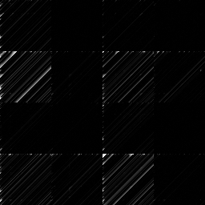
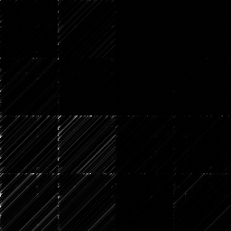
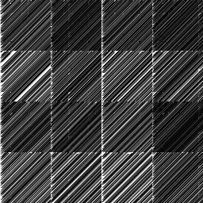
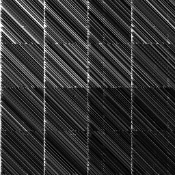

# TentHash's Design Rationale

This document explains the rationale behind TentHash's design.  See the [specification document](specification.md) for a complete and concise description of TentHash.

(Pre-1.0 this document serves not only to explain the rationale behind TentHash's design, but also to describe the claims I think I can make about TentHash's properties so that others can more easily audit those claims.)


## Goals

TentHash aims to be a robust *non-cryptographic* message digest that is simple to implement while still being reasonably fast.  More specifically, its design goals are (in order of priority):

1. **Robust collision resistance.**  For all practical purposes, it should be safe to assume that different pieces of (legitimate) data will never have colliding hashes.  Moreover, the size of the output digest should *accurately reflect* the likelihood of such collisions.
2. **Simplicity and portability.**  It should be easy to understand and straightforward to write conforming implementations, without need for special hardware instructions.
3. **Reasonably fast.**  It doesn't need to win any speed competitions, but its speed should be measured in GB/sec not MB/sec.

On the other hand, TentHash is explicitly **not** trying to be secure against attacks.  Again, it is a *non-cryptographic* hash function.


## The xor & mix loop.

TentHash mixes the input data into the hash state with a simple xor-and-mix loop, like so:

```
for block in input_data:
    hash_state ^= block
    mix(hash_state)
```

This approach was chosen because of its simplicity and because it's more than sufficient with a good mixing function.

Assuming a good mixing function, this loop accomplishes three important things:

1. It gives every input bit a good chance of affecting every output bit in the digest.  Meaning that flipping any single bit in the input will, with overwhelming probability, significantly change the output digest.  (This is also called "avalanche".)
2. It gives the relationship between all input bits a *high complexity*.  Meaning that, with overwhelming probability, the effect of flipping a single input bit can only be "cancelled out" by a complex random change elsewhere in the input, not a simple change.
3. It *strongly orders* the blocks of input data.  Meaning that, with overwhelming probability, swapping any two input blocks will significantly change the output digest.


## The mixing function.

TentHash's mixing function uses essentially the same mixing approach as [Skein](https://en.wikipedia.org/wiki/Skein_%28hash_function%29).  This approach was chosen for several reasons:

1. It's simple and easy to implement.
2. The most complex operation it uses is a 64-bit addition, which makes porting even to constrained platforms straightforward.
3. It's reasonably fast on modern hardware.
4. It satisfies the basic requirements of a good mixing function, such as being bijective, increasing entropy, and mixing the whole state together.

The basis of this approach is what the Skein paper calls the "MIX" function.  It takes two unsigned 64-bit integers and mixes them together like this:

```
MIX(X, Y, rotation_constant):
    X += Y
    Y = (Y <<< rotation_constant) ^ X
```

Iterating the MIX function mixes the bits between `X` and `Y`.  To extend the MIX function to work with four integers, Skein applies the function to pairs of integers, permuting the order of the integers at each iteration:

```
MIX4(hash_state, rotation_constants):
    MIX A B rotation_constants[0]
    MIX C D rotation_constants[1]
    swap B D
```

After just two iterations of `MIX4` above, all four integers have had a chance to affect every other integer.  And after 9 iterations, the state is fully diffused (assuming good rotation constants).

TentHash uses the same mixing algorithm, just ordered a little differently for better pipelining and parallelism opportunities.  The core TentHash mixing function, then, looks like this:

```
MIX4(hash_state, rotation_constants):
    MIX A C rotation_constants[0]
    MIX B D rotation_constants[1]
    swap A B
```

TentHash runs the loop for 7 iterations.  This doesn't achieve full 256-bit diffusion of the hash state, but rather is the minimum number of iterations needed to achieve at least 128 bits of diffusion, which is TentHash's target collision resistance strength.  (How TentHash ended up with a 160-bit digest is covered later in this document.)

Notably, many fast non-cryptographic hash functions skimp on the mixing in between blocks of input data.  In practice, that's *probably* fine depending on the extent of the skimping and other design considerations.  But to be *conservative* in ensuring the target strength, the bits of diffusion between data blocks should equal or exceed the target strength of the hash.  So that's what TentHash does.

One final important point: TentHash's mixing function is **zero sensitive**, meaning that if the hash state is all zeros, the mixing function effectively does nothing and will also produce an all-zero state.  However, this isn't a problem for a few reasons:

1. The state space is 2<sup>256</sup>, which makes it vanishingly unlikely for the state to ever become zero by random chance.  It's even less likely than a hash collision, given that the digest size is 160 bits.
2. Outside of intentional attacks (which TentHash isn't trying to protect against), the only non-random chance of an all-zero hash state is for the first data block to equal TentHash's (now published) initial hash state, which would then cancel each other out.  However, this is very unlikely in a legitimate data stream.
3. Even if the initial state were cancelled out, the only way for the hash state to *remain* zero is subsequent all-zero data blocks.  So for an input data stream to maintain an all-zero hash state for more than one iteration, it will (with overwhelming probability) follow the pattern `[initial_state, 0...0, possibly_some_other_data]`.  And since the input data length is incorporated into the hash during finalization, that disambiguates any such patterns.

So although the mixing function is indeed zero-sensitive, that doesn't weaken the collision resistance of the overall hash function.


## The mixing rotation constants.

The Skein paper provides the following 8 pairs of rotation constants for its 256-bit variant:

```
14 16
52 57
23 40
 5 37
25 33
46 12
58 22
32 32
```

TentHash doesn't use those pairs.  It uses the following 7 pairs instead:

```
51 59
25 19
 8 10
35  3
45 38
61 32
23 53
```

This is because Skein's constants are optimized for the iterations and key schedule used in the Skein hash, whereas TentHash's constants are simply optimized for 7 iterations since that's the number of iterations between input data blocks.  Moreover, TentHash's constants are optimized for a similar but *slightly* different metric than Skein's.  Skein's constants are optimized to minimize the maximum bias, where as TentHash's are optimized to maximize the diffusion of the least-diffused input bit.  That's a bit of a mouthful, so let's walk through exactly what that means.

The diffusion and bias of a mixing function can be visualized with a bias graph, like so:



The vertical axis is the input bit and the horizontal axis is the output bit.  Each pixel in the graph represents the *bias* of an input bit's effect on an output bit, with black being zero bias (good) and white being 100% bias (bad).

In other words, each horizontal row of pixels visualizes how well a given input bit is diffused into the hash state.  The darker the row, the better.

The graph above is the original Skein-256 mixing function at 7 rounds.  And this is TentHash's mixing function, also at 7 rounds:



(Side note: both mixing functions are completely black at 9 rounds, indicating full diffusion.)

The four-integer nature of the mixing functions is obvious in both graphs, with sharp transitions that form a 4x4 block appearance.  And in both graphs, the lightest horizontal rows (representing the input bits that are least-well diffused) are at the borders between those blocks.

Skein's constants were optimized to make the lightest single pixel as dark as possible, whereas TentHash's constants have been optimized to make the lightest *row* as dark as possible.  In other words, TentHash's constants are optimized to maximize the over-all effect of the weakest input bit.

The reason for this different metric is that TentHash (intentionally) doesn't do enough rounds between input blocks to fully diffuse the 256-bit hash state.  Instead we want the mixing to be equivalent (in terms of the entropy introduced) to fully diffusing a smaller hash state.  And the conservative measure of that equivalence is the diffusion of the least-diffused input bit.  And that, in turn, is the conservative measure of TentHash's collision resistance.

With TentHash's constants at 7 iterations, the diffusion is *conservatively* equivalent to fully diffusing a 176-bit hash state.  Whereas with Skein's constants and mix function at 7 iterations it's only 148 bits.

Importantly, TentHash's constants weren't only optimized on random inputs, but also on patterned inputs that the mix function is particularly poor at.  And the 176-bit equivalence is measured with respect to the worst of those (inputs with nearly all bits set to zero) resulting in the following bias graphs (top Skein, bottom TentHash, both at 7 iterations):





For random inputs (the earlier graphs, and the overwhelmingly likely case in practice), the equivalence is 228 bits.  *Additionally*, the measure of diffusion used for the numbers given so far is simply `256 bits * (1.0 - bias)`.  Whereas the correct measure is to compute the Shannon entropy, in which case instead of 176 bits it's 222 bits (and instead of 228 for random inputs it's 247).

In other words, at *every step* the measures used have, if anything, been over-conservative.

The reason for using 7 iterations rather than 6 or fewer is that even the best-optimized constants at 6 iterations didn't reach 128 bits of diffusion, even under the more favorable Shannon entropy measure.  And since TentHash's target collision-resistance strength is 128 bits, that forced bumping the iterations up to 7.

After optimizing for 7, the strength is *conservatively* 176 bits.  Hence why TentHash ended up as a 160-bit hash: it was the next-shortest common output hash length from TentHash's internal state strength.


## Xoring the input length.

Because the last block of a message is padded out to 256 bits with zeros, messages with the same prefix but ending in a different number of zeros could collide.  For example, consider the following two input messages:

- `0xabc000`
- `0xabc00000`

Since both messages are shorter than 256-bits, they will both be padded to 256 bits with zeros (making them identical) before being added to the hash state.  This in turn would result in a hash collision.  This weakness is a direct result of the zero-padding scheme.

There are a couple of different ways to fix this weakness:
1. Append a single `1` bit to the end of the message, resulting in `0xabc0008` and `0xabc000008` in the above example.
2. Incorporate the message length into the hash.

Both approaches are good, but the second approach is slightly simpler to implement, so TentHash opts for that approach and simply xors the message length into the hash state before finalization.

Approach 2 also has the benefit of helping protect against the zero sensitivity of the mixing function (see the section on the mixing function for details), which means the xor-mix loop doesn't need to do any additional work to break that zero sensitivity.


## The initial hash state.

TentHash's initial hash state constants are just random numbers, generated via [random.org](https://www.random.org/cgi-bin/randbyte?nbytes=32&format=h).  They have no special significance aside from now being part of the TentHash specification.

TentHash could have instead used an initial state of e.g. all zeros.  But a gibberish state was chosen for a couple of reasons:

1. A gibberish initial state means that the mixing function will--with very high likelihood--always perform at its higher random-input level of diffusion.  (Although this isn't necessary: see the section on rotation constants for details.)
2. A gibberish initial state helps protect against the zero sensitivity of the mixing function (see the section on the mixing function for details), which (again) means the xor-mix loop doesn't need to do any additional work to break that zero sensitivity.


## Double-mixing during finalization.

The hash state is mixed twice during finalization to fully diffuse the entire 256-bit hash state, since (as discussed in the section about rotation constants) a single call to the mixing function doesn't fully diffuse the state.

This wouldn't be necessary if we used the entire state as the digest.  But since TentHash truncates the state to 160 bits, full diffusion ensures that there is no bias in the final digest.  It also has the nice benefit that client code can further truncate the digest as much as they want.

(Aside: strictly speaking, the *input data* itself is already fully diffused after just the first finalization mixing call.  But to ensure the message length is also fully diffused, two calls are necessary.)


## Q&A

The above sections have broadly covered the rationale behind TentHash's design.  This section answers related questions that people might have.


### Q. Why yet another hash?  Why not just use \[hash name here\] instead?

Because all the cryptographic hashes I'm aware of are slow and/or are complex to implement, and all the non-cryptographic hashes I'm aware of with sufficiently large digest sizes are at least one of:

- Slow.
- Complex and/or inscrutable.
- Reliant on special hardware instructions for reasonable performance.
- *Undocumented,* which in turn means that:
    - Independent implementations have to infer how the hash works from source code.
    - The rationale and tradeoffs of the design aren't up-front or easy to evaluate.

I wanted a hash that was useful as a message digest, simple to implement/port, reasonably fast, and *documented*.  And as far as I was able to find, no such hash existed.

It's possible, of course, that I missed one!  In which case: oops, we have an extra hash function now.


### Q. Why is TentHash slower than some other fast hashes?

One reason is that TentHash is conservative in its design with respect to collision resistance.  Most fast hashes (particularly the ones that hash at 10+ GB a second) skimp on internal state diffusion between incorporating input blocks.  That skimping *may* be okay, but it also may negatively impact collision resistance.  And it's not feasible to test that empirically at the digest sizes in question.

Additionally, some hashes (e.g. xxHash and its variants) are designed to maximally exploit SIMD processing.  And others use special AES or CRC hardware instructions.  This is a fine design choice, and certainly helps them be fast on modern hardware.  But it's at the expense of complexity and/or easy portability.

In other words, TentHash prioritizes quality and simplicity over maximum possible performance, whereas other hashes often prioritize performance over either quality or simplicity (or sometimes both).  TentHash still cares about performance, of course.  Just not as the *top* priority.


### Q. Does TentHash pass the SMHasher test suite?

Yes, trivially.  Including all power-of-two truncations down to 32 bits (the smallest SMHasher will test).  But with two qualifications:

1. TentHash isn't seedable, so it of course doesn't pass the seeding tests.  But if you simply prepend (or append, either way) the seed to the input data, then TentHash passes the seeding tests as well.
2. The SMHasher suite can only test power-of-two digest sizes, and TentHash is 160 bits.  To get around this, in place of testing 160 bits I tested 256 bits by outputting the entire internal state as a digest.

(Aside: qualification 2 is interesting because we know from the analysis earlier in this document that TentHash isn't strictly 256 bits strong.  And yet it still cleanly passes SMHasher as a 256-bit hash.  This isn't because SMHasher is bad—it's not!  Rather, this is because even at just moderately sized hashes it's impossible to fully test a hash function for issues empirically.  In other words, SMHasher and similar test suites are useful, and hashes ought to pass them.  But *don't design your hashes against them*, lest you fall victim to Goodhart's law.)


### Q. Why isn't TentHash seedable?

I'm not aware of any uses for seeding with TentHash's intended use case (non-cryptographic message digests).

Seeds are useful for cryptographic hashes in various circumstances, but as a non-cryptographic hash TentHash isn't appropriate in those circumstances.  Seeds can also be useful for non-cryptographic hashes with small (32 or 64-bit) output sizes in various applications, but TentHash isn't targeting those applications.

Additionally, if seeding really is needed for some application, it can be easily accomplished by simply prepending or appending the seed to the input stream.  So there's no reason it needs to be part of the TentHash specification.


### Q. Why the 160-bit digest size?

160 bits actually exceeds the design target for TentHash, which was 128 bits.

The reason for the 160-bit digest is simply that, after optimizing the mixing function, that's the closest common output size that doesn't exceed the collision resistance of TentHash's internal state.  And since people can always truncate down to 128 bits if desired, there isn't much reason to *not* provide 160 bits.


### Q. Why the 256-bit internal state size?

In my testing, 256 bits struck a good balance between having good performance and having a simple implementation.

128 bits resulted in a slightly simpler implementation, but also significantly reduces performance: with 256 bits you can process roughly twice as much data in the same time due to instruction-level parallelism.  Also, at 128 bits the Skein MIX function requires more rounds to achieve sufficient diffusion, so it would also be slower due to needing to bump the number of rounds up.

512 bits, on the other hand, notably increased implementation complexity.  And although it certainly has the potential for performance gains with a wide SIMD implementation, a straightforward scalar implementation decreased performance compared to 256 bits.

So given TentHash's goals, 256 bits felt like it hit a good sweet spot: good performance with a simple implementation.


### Q. Why aren't there special cases to speed up hashing of small inputs?

This is a common approach to make hash functions optimally fast across a range of input sizes, as exemplified by MurmurHash.  If done properly, it's an excellent approach.

I decided against this for TentHash because of TentHash's intended application (message digests) and its goal of simplicity.  Generally speaking, small inputs (16 bytes or less) aren't the expected common case for TentHash, so adding complexity to squeeze more performance for those cases felt counterproductive.


### Q. Why not process striped data in multiple independent lanes for faster SIMD execution?

Some fast hashes do indeed take this approach.  And it works really well for improving performance: since the lanes never interact until the end, you can run them perfectly in parallel.

However, doing that reduces the collision resistance of the whole hash to that of a single lane.  For example, if your lane size is only 64-bits wide, then using the striped-data independent-lane approach results in a hash with a collision resistance that's equivalent to a 64-bit hash.  And this is true even if the lanes are mixed into e.g. a 256-bit digest at the end.  So with small lane sizes the striped-data independent-lane approach isn't appropriate for a hash with TentHash's goals.

Using 128-bit lanes would be fine.  However, as mentioned above, Skein's MIX function requires more rounds for sufficient diffusion at that size.  Combined with the fact that the 256-bit version is already mostly parallelized by instruction-level parallelism on modern CPUs, there's a good chance that the two-lane approach with SIMD would actually be slower.  And it's certainly a performance loss with a scalar implementation.

Lastly, keeping things to a single lane simplifies the implementation a little because you don't need to combine the lanes at the end.


### Q. Why doesn't TentHash use multiple threads for faster hashing?

Because it adds implementation complexity.  And because (as with any hash function) multi-threading can be layered *on top of* TentHash in applications that need it:

* If you have multiple items of data to process, you can simply dispatch each item to a different thread.  That's simpler than using multi-threading to process a single data item, and as long as you have enough data items to keep the threads mostly busy it should be about as fast.
* If you do need to process a single data item with multiple threads, either using striping or a Merkle-tree construction with TentHash as the base hash function will work just fine.  The resulting digest will be different from plain TentHash, of course.  But as long as that fact is properly documented that's not a problem.
