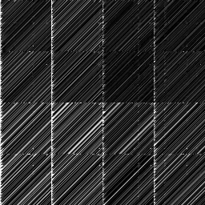

# TentHash's Design Rationale

This document explains the rationale behind TentHash's design.  It assumes that you have already read the [specification document](specification.md), which is a complete and concise description of TentHash but without any rationale provided.

This document focuses on how TentHash's design affects the quality of the hash, but there is a Q&A at the end that also addresses topics like speed and seeding.


## Design

TentHash has an intentionally non-innovative, basic design.  It tries to stick to well-understood constructions that are easy to analyze.

At a high level, TentHash is essentially a [Merkle–Damgård](https://en.wikipedia.org/wiki/Merkle%E2%80%93Damg%C3%A5rd_construction) hash with a simple xor-and-mix step as the compression function.  Importantly, unlike a cryptographic hash, TentHash's compression function is easily reversible, and therefore [engineering inputs that produce specific hashes](../supplemental/collision/src/main.rs) is straightforward.

TentHash's goal is not cryptographic security, however.  Rather, its goal is to be robust against collisions when hashing legitimate data.  "Legitimate data" in this case means any data not intentionally engineered to create hash collisions in TentHash.  It needn't be limited to uncorrupted, tamper-free, or "real" data, just as long as the tampering etc. wasn't done with the intention of creating hash collisions.

The subsections below discuss TentHash's components and their contributions to this goal.


### The xor & mix loop.

TentHash absorbs input data into the hash state with a simple xor-and-mix loop, like so:

```
for block in input_data:
    hash_state ^= block
    mix(hash_state)
```

With only minimal assumptions about the `mix` function, this absorption loop has some really nice properties while also keeping things simple.

The first property is that as long as the `mix` function is [bijective](https://en.wikipedia.org/wiki/Bijection) (a.k.a. invertible), then it is impossible to create collisions in the full 256-bit hash state through alterations to only a single input block.  To create hash state collisions you must either change the length of the message or alter the contents of *at least two* blocks.  Another way to put this is that if you hold the entire input message constant except for the contents of one block, then the entire absorption loop is a bijection of that one block.  (You can get some intuition for why this is by considering what happens with a no-op `mix` function, which is trivially bijective.)

This is a really useful property because it means it's impossible for a block to interact poorly with itself, and therefore we only need to consider the interactions *between* blocks when analyzing the chances of hash state collisions.

The second property of the xor-and-mix loop is that as long as the `mix` function is a reasonable stand-in for a random permutation and [fully diffuses](https://en.wikipedia.org/wiki/Confusion_and_diffusion#Diffusion) the hash state, then the probability of a hash state collision being produced by altering two or more blocks is the same as the probability of finding duplicates in a random set of 256-bit numbers.

This property is a little harder to develop intuition for, but I'll do my best to provide some with an informal "proof" of sorts:

Let's consider a message with exactly two 256-bit blocks.  We'll call the first block `x` and the second block `y`.  The goal is to alter `x` and `y` together in a way that produces a hash state collision.  We'll call those altered blocks `X` and `Y`.  To successfully create a hash state collision, we must satisfy the following equation:

```
mix(initial_state ^ x) ^ y = mix(initial_state ^ X) ^ Y
```

(Note: in these equations `mix()` returns the mixed result, rather than altering data in-place like in the TentHash spec.)

Without loss of generality, we can assume the initial hash state is all zeros, which simplifies the equation to:

```
mix(x) ^ y = mix(X) ^ Y
```

If `mix()` fully diffuses its input, that means that flipping even just a single bit in `x` will cause `mix()` to produce (effectively) a completely different random result.  So then the equation we must satisfy effectively becomes this:

```
mix(x) ^ y = random_number ^ Y
```

In other words, altering `x` and `y` in a way that still produces the same output requires altering `y` in a way that cancels out a random 256-bit number, which implies that the alteration to `y` must also be a random 256-bit change.  And the chances of a particular random 256-bit change happening is 1 in 2<sup>256</sup>.

Hopefully that provides some intuition.

There is one more point to address, however, and that's *swapping* blocks.  Imagine if our absorption loop were this:

```
for block in input_data:
    hash_state ^= mix(block)
```

This would also satisfy the same informal "proof" I just gave, just with the equation we need to satisfy being:

```
mix(x) ^ mix(y) = mix(X) ^ mix(Y)
```

The problem, however, is that if the alteration you make to `x` and `y` is to *swap* them, then the equation becomes:

```
mix(x) ^ mix(y) = mix(y) ^ mix(x)
```

Which is trivially true.  In other words, this alternate absorption loop doesn't care about the order of the blocks, which is a problem.

However, the absorption loop TentHash actually uses *does* care about block order.  For a block swap to cause a hash state collision with TentHash's actual absorption loop, the equation we must satisfy is:

```
mix(x) ^ y = mix(y) ^ x
```

And this boils down to the same 1 in 2<sup>256</sup> chance as the previous analysis.

**However...**

Having said all of that, although TentHash's mixing function is indeed bijective, it *doesn't* fully diffuse the hash state.  Additionally, TentHash's mixing function is also *zero sensitive*, meaning that if the hash state is all zeros, it *remains* zeros after mixing.

Both of these have the potential to be issues for hash quality.  However, in TentHash's case neither of them actually are.

Even though TentHash's mixing function doesn't fully diffuse the hash state, it *does* diffuse it to the equivalent of fully diffusing a 160-bit hash state.  The specifics of what "equivalent" means here is discussed in the sections below about the mixing function itself.  But the big-picture point is that the analysis we did above that showed probabilities of 1 in 2<sup>256</sup> still applies, just with 1 in 2<sup>160</sup> instead.  Since our final hash output is 160 bits, that means *we can't do better than 1 in 2<sup>160</sup>* for the overall hash function anyway, so that ends up being fine.

The zero sensitivity ends up not being an issue for a completely different reason, which is explained in the section further below about incorporating the message length.


### The mixing function.

As discussed in the previous section, for TentHash to be high quality, its mixing function must meet two criteria:

1. It must be bijective.
2. It must sufficiently diffuse the hash state.  In this case, "sufficiently" means that every bit should be diffused to at least the equivalent of the final output size of 160 bits.

TentHash also has some non-quality goals, and the mixing function should adhere to those as well.  It should be:

1. Simple to implement.
2. Easy to port to a variety of hardware architectures.
3. Reasonably performant.

Rather than rolling my own bespoke mixing function from scratch, I started with the mixing function from [Skein's](https://en.wikipedia.org/wiki/Skein_%28hash_function%29) 256-bit variant, which already meets all of the above criteria:

```
ROTATIONS = [
    [14, 16], [52, 57], [23, 40], [ 5, 37]
    [25, 33], [46, 12], [58, 22], [32, 32]
]

fn skein_mix(A, B, C, D, rounds):
    for i in 0..rounds:
        A += B
        C += D
        B = (B <<< ROTATIONS[i % 8][0]) ^ A
        D = (D <<< ROTATIONS[i % 8][1]) ^ C
        swap(B, D)
```

Skein's mixing function repeatedly iterates a much simpler mix function on a set of four 64-bit integers, using different rotation constants each round.  Two of the integers are swapped every round such that every integer affects every other integer over repeated iterations.  (See the [Skein paper](https://web.archive.org/web/20140824053109/http://www.skein-hash.info/sites/default/files/skein1.3.pdf) for more details.)

TentHash's mixing function uses the same construction, but slightly tweaked:

```
ROTATIONS = [
    [16, 28], [14, 57], [11, 22], [35, 34],
    [57, 16], [59, 40], [44, 13],
]

fn tenthash_mix(A, B, C, D):
    for i in 0..7:
        A += C
        B += D
        C = (C <<< ROTATIONS[i][0]) ^ A
        D = (D <<< ROTATIONS[i][1]) ^ B
        swap(A, B)
```

The most obvious tweak is the different rotation constants and the fixed number of 7 rounds, which are discussed in the next section.  But there are two other tweaks, which we'll briefly discuss here.

First, the arrangement of the ABCD integers in the inner loop is different.  This different arrangement makes SIMD implementations a tad more straightforward, which may be worthwhile on some platforms.

Second, *A and B* are swapped at the end of each round rather than C and D (the equivalent of B and D in Skein's arrangement).  In some back-of-the-napkin analysis I did, it appeared that this improves instruction level parallelism.  I'm not completely sure that analysis was correct, but in practice it does indeed give a small speed boost, whether due to instruction level parallelism or other factors. (In fact, the compilers I tested on all unroll the loop and elide most of the swaps anyway, so it's probably due to other factors.)

In any case, the important thing to point out is that neither of these tweaks make any *functional* difference: this mixing function is structurally equivalent to Skein's.

To provide additional confidence in this mixer construction, I also implemented a [range of statistical tests on a reduced-size version of it](../supplemental/tiny_mixer), including collision tests, a bit independence criterion test, and a higher-order avalanche test.  These reduced-size tests are not proof that all the same properties hold for the full-size variant, but they are good evidence that the general construction is sound and has good statistical properties beyond just basic diffusion.


### The mixing function's rotation constants.

*(For those who are curious about the details of how TentHash's rotation constants were generated, please see [the source code of the program that generated them](../supplemental/optimize_constants).  This section discusses what the constants were optimized for and why, as well as the results of that optimization, but not the specifics of the optimization approach itself.)*

Skein's rotation constants were optimized to reach full diffusion of the whole hash state as quickly as possible.  This is because Skein fully diffuses the hash state *many times over* between input blocks, and its cryptographic strength (according to the authors—I have no cryptography expertise) benefits from maximizing the number of those full diffusions.

However, TentHash doesn't need to fully diffuse its hash state between input blocks.  Rather, it needs to diffuse the hash state to the equivalent of TentHash's 160-bit output size in as few rounds as possible.  As discussed in the "xor & mix loop" section, a hash cannot have a lower collision probability than its final output size permits, and therefore diffusing beyond the equivalent of that output size is unnecessary (at least for a hash with TentHash's goals).

The conservative measure of that diffusion equivalence is how well diffused the *least-well-diffused* input bit is.  So that's the measure that TentHash's constants are optimized for.

To help illustrate what I'm talking about, here is a bias graph of TentHash's mixing function:


The vertical axis is the input bit and the horizontal axis is the output bit.  Each pixel in the graph represents the *bias* of an input bit's effect on an output bit, between 0.0 and 1.0, with black being 0.0 (good) and white being 1.0 (bad).  In other words, each horizontal row of pixels visualize how well a given input bit is diffused into the hash state, and the darker the row is overall, the better.

And that's what TentHash's constants have been optimized for: to make the lightest row as dark overall as possible within 7 rounds.  Or to be more specific, two different measures of diffusion were computed for each row, one ad-hoc and the other grounded in information theory: the former is the row's summed inverse bias ("inverse bias" meaning `1.0 - bias`), and the latter is the row's Shannon entropy.  The goal was to maximize those measures in the worst row.

Note that the above bias diagram was produced using random inputs.  With random inputs the bias graph is quite dark.  In that graph the least-well-diffused input bit has a summed inverse bias of 233 bits and a Shannon entropy of 249 bits, both far above 160 bits.

However, TentHash aims to be conservative about quality, and [optimizing against random inputs doesn't produce the best results](http://zimbry.blogspot.com/2011/09/better-bit-mixing-improving-on.html), nor is it the most conservative measure of diffusion.  Therefore the rotation constants weren't just optimized against random inputs, but also patterned inputs.  For example, an incrementing counter.  Here is the bias graph of the worst of those patterns:



This represents the worst case I was able to find for the performance of TentHash's mixing function.  In this worst case, the least-well-diffused input bit has a summed inverse bias of 179 bits and a Shannon entropy of 225 bits.

Even the lowest of those numbers, 179, is comfortably above 160 bits.

This does raise the question, however: can you accomplish enough diffusion with fewer than 7 rounds?

It turns out that you can, depending on how conservative you want to be about quality.  For example, if you only consider random inputs then 6 rounds is enough to achieve 160 bits of Shannon entropy.  However, when considering patterned inputs, even the best optimized set of 6-round constants I found couldn't reach 128 bits of Shannon entropy.  So I decided to bump it up to 7 rounds to be on the safe side.

TentHash is perhaps being over-conservative here, and could get a bit of a speed boost if it switched to 6 rounds.  However, my rationale for 7 rounds is that having a healthy quality margin is good given TentHash's intended use cases.  Due to human factors, trying to ride too close to the edge of quality for the sake of performance makes unintentional compromises on quality more likely, and I wanted to stay away from that.


### The initial hash state.

TentHash's initial hash state constants are just random numbers, generated via [random.org](https://www.random.org/cgi-bin/randbyte?nbytes=32&format=h).  They have no special significance aside from now being part of the TentHash specification.  TentHash could have instead used an initial state of all zeros, but using gibberish protects against collisions in data that's generated via similar/related algorithms to TentHash's mixing function.

The collision probabilities from the analysis in the "xor & mix loop" section are only valid insofar as the input data isn't correlated with the hash function.  So, as just one example, data generated via a process [similar or identical to running TentHash in reverse](../supplemental/collision/src/main.rs) can correlate the data with TentHash and therefore increase the likelihood of collisions among the data generated that way.

As unlikely as it is that someone would legitimately generate data in ways that correlate with TentHash, it's also easy to protect against by setting our initial state to gibberish.  TentHash's mixing function produces completely uncorrelated results (up to 160 bits, anyway) with just a single bit flip.  So by setting the initial state to gibberish, we ensure that *even data generated by exactly reversing TentHash's algorithm* will be completely uncorrelated with actual TentHash if even one bit of that initial state isn't reproduced exactly.

Reproducing that initial state is easy to do on purpose, of course.  But again, TentHash isn't trying to protect against intentional collisions.  The thing we're protecting against with the gibberish initial state is someone coincidentally stumbling upon the same or similar algorithm as TentHash as a means of generating legitimate data.  If that does happen, they would *also* have to coincidentally choose the exact same gibberish numbers as TentHash in order to actually correlate, which has a 1 in 2<sup>256</sup> chance of happening.

This is *probably* unnecessary to protect against in practice.  But since it's basically free to do, there's no reason not to, and it gives us hard bounds on the probabilities of correlation rather than a hand-wavey "this *probably* won't happen, because who would do that?"

(I suppose there's also the very slim chance that someone sees TentHash and honestly thinks, "Running this exactly in reverse, including the gibberish initial state, looks like a great way to generate data!"  But at that point I think it's fair to call it malicious stupidity and categorize the resulting data as non-legitimate.  Additionally, such a person would only be hurting themselves, since data generated that way would only have an increased chance of colliding with other data generated in the same way, not with other data in general.)

An additional side benefit of the gibberish initial state is that (aside from the chance of someone placing TentHash's initial state at the start of some data for a legitimate reason) it also makes it overwhelmingly likely that TentHash's mixing function will operate at the higher diffusion level it gets with random inputs (as discussed in the section on rotation constants) throughout the entire hashing process.  This is not necessary, but it does provide even more quality margin under almost all realistic circumstances, which is nice.


### Incorporating the input length.

Incorporating the message length into the hash accomplishes two things, both of which have to do with zeros.

**First,** because the last block of a message is padded out to 256 bits with zeros, messages with the same prefix but ending in a different number of zeros could collide.  For example, consider the following two input messages:

- `0xabc000`
- `0xabc00000`

Since both messages are shorter than 256-bits, they will both be padded to 256 bits with zeros (making them identical) before being added to the hash state.  This in turn would result in a hash collision.  This zero-extension weakness is a direct result of the zero-padding scheme.

Xoring the message length into the hash state during finalization handily distinguishes such cases, addressing that issue.

**Second,** it protects against collisions due to the zero-sensitivity of the mixing function.  Recall that if the hash state is all zeros, then TentHash's mixing function effectively does nothing, leaving the state all zeros.  This means that if the hash state ever becomes all zeros then *any number of all-zero blocks* could follow and there would be no change in the hash state.  In other words, in such a case it's not possible to distinguish how long that string of zero blocks is from just the xor-and-mix loop itself, and that in turn can create hash collisions.

Having said that, the chances of the hash state ever becoming all zeros in the first place are extremely low.  The only meaningful chance of that happening non-maliciously is someone legitimately putting TentHash's (now published) initial state at the very start of some piece of data, which would cancel out the hash state at the very beginning of the hashing process.  Outside of that, it's a 1 in 2<sup>256</sup> chance per input block, which even with an enormous number of blocks is a significantly smaller chance than an actual hash collision in a good 160-bit hash function.

So in practice, this *probably* isn't something we actually need to protect against.

Nevertheless, incorporating the message length distinguishes the "initial hash state as the first block of data, followed by N zero blocks" cases, which is the only way this issue could come up that isn't overwhelmingly improbable.


### Double-mixing during finalization.

The hash state is mixed twice during finalization to fully diffuse the entire 256-bit hash state, since (as discussed in the section about rotation constants) a single call to the mixing function doesn't fully diffuse the state.

This wouldn't be necessary if we used the entire state as the digest.  But since TentHash truncates the state to 160 bits, full diffusion ensures that there is no bias in the final digest.  It also has the nice benefit that client code can further truncate the digest as much as they want without any unexpected effects.

(Aside: strictly speaking, the *input data* itself is already fully diffused after just the first finalization mixing call.  But to ensure that the incorporated message length is also fully diffused, two calls are necessary.)

Note that it only takes 9 rounds of mixing to fully diffuse the hash state, whereas two mix calls does 14 rounds (7 rounds for each call).  Therefore a little performance is left on the table by making two calls.  However, this is only done during finalization, and therefore this is small constant overhead, completely independent of the length of the input.  Moreover, this approach allows implementations to have just a single, simple mix function with no tweak parameters.  Given TentHash's goal of simplicity, this seemed like an appropriate tradeoff.


## Q&A

The above sections have broadly covered the rationale behind TentHash's design, with a focus on TentHash's quality.  This section answers other questions that people might have.


### Q. Does TentHash pass the SMHasher test suite?

Yes, trivially.  Including all power-of-two truncations down to 32 bits, the smallest SMHasher will test.  But with one qualification: TentHash isn't seedable, so it of course doesn't pass the seeding tests (e.g. the Perlin Noise test).  However, if you simply prepend the seed to the input data then TentHash passes the seeding tests as well.

It's important to keep in mind that [passing SMHasher is insufficient evidence of quality for large-output hashes](https://blog.cessen.com/post/2024_07_10_hash_design_and_goodharts_law) like TentHash.  This entire document serves as much better evidence of quality than a passing score from SMHasher.  (Although if TentHash did *not* pass SMHasher that would indeed be extremely strong evidence that it *wasn't* high quality.)


### Q. Why isn't TentHash seedable?

I'm not aware of any uses for seeding with TentHash's intended use case (non-cryptographic message digests / fingerprints).

Seeds are useful for cryptographic hashes in various circumstances, but as a non-cryptographic hash TentHash isn't appropriate in those circumstances.  Seeds can also be useful for non-cryptographic hashes with small (32 or 64-bit) output sizes in various applications, but TentHash isn't targeting those applications.

Additionally, if seeding really is needed for some application, it can be easily accomplished by simply prepending the seed to the input stream.  So there's no reason it needs to be part of the TentHash specification.


### Q. Why does TentHash incorporate the message length in bits rather than bytes?

Because this way TentHash is well defined for messages of any bit length.  This has no practical benefit since all modern computing is based on 8-bit bytes, but it also has essentially no cost and it made me feel good.


### Q. Why is TentHash slower than some other non-cryptographic hashes?

One reason is that TentHash tries to be conservative in its design with respect to hash quality.  Many other hashes, whether intentionally or unintentionally, make potential concessions on hash quality in favor of speed.  Some of those concessions *may* be okay, but they also may negatively impact robustness against collisions.  It's unfortunately not feasible to directly test that empirically for hashes with large digest sizes, so TentHash chooses not to take that risk, which is one thing that makes it slower.

Another factor is TentHash's choice to be simple and easily portable.  Many hashes are designed to maximally exploit SIMD processing, and others use special AES or CRC hardware instructions.  This is a fine design choice, and certainly helps them be fast on modern hardware.  But it's at the expense of complexity and/or easy portability.

In other words, TentHash prioritizes quality and simplicity over maximum possible performance, whereas other hashes often prioritize performance over either quality or simplicity (or sometimes both).  TentHash still cares about performance, of course.  Just not as the *top* priority.

Having said that, I'm sure it's possible to create a hash function that is both conservative about quality and simple while also being faster than TentHash.  I make no claim that TentHash has somehow found the peak of that design space, and I am looking forward to seeing other (properly documented and justified!) hashes appear in the future that are better than TentHash in this space.


### Q. Why the 160-bit digest size?

TentHash's original intended digest size was actually 128 bits, matching most other large-size non-cryptographic hashes.

The reason for the 160-bit digest is that, after optimizing the mixing function, that's the closest common output size that doesn't exceed the internal hash state's robustness against collisions (according to the most conservative metric of diffusion that was measured).  And since people can always truncate down to 128 bits if desired, there isn't much reason to *not* provide 160 bits.


### Q. Why the 256-bit internal state size?

In my testing, 256 bits struck a good balance between having good performance and having a simple implementation.

128 bits resulted in a slightly simpler implementation of the mix function, but also significantly reduced performance: with 256 bits you can process roughly twice as much data in the same time due to instruction-level parallelism.  Also, at 128 bits the mix function requires more rounds to achieve sufficient diffusion, so it would also be slower due to needing to bump the number of rounds up.

512 bits, on the other hand, increased implementation complexity more than I wanted.  And although it certainly has the potential for significant performance gains with a wide SIMD implementation, a scalar implementation that mixed the entire hash state together was slower in my testing, and an independent-lane-based approach with scalar code was only marginally faster.

So given TentHash's goals, 256 bits felt like it hit a good sweet spot: good performance with a simple implementation.


### Q. Why aren't there special cases to speed up hashing of small inputs?

This is a common approach to make hash functions optimally fast across a range of input sizes, as exemplified by MurmurHash.  If done properly, it's an excellent approach.

I decided against this because of TentHash's intended application (message digests) and its goal of simplicity.  Small inputs aren't the expected common case for TentHash, so adding complexity to squeeze more performance for those cases felt counterproductive.


### Q. Why not process striped data in multiple independent lanes for faster SIMD execution?

Some fast hashes do indeed take this approach, and it works really well for improving performance: since the lanes never interact until the end, you can run them perfectly in parallel.

However, TentHash already takes good advantage of instruction-level parallelism in its mix function, such that it's already benefiting from most of the performance gains you would get from two 128-bit lanes.  Moreover, making independent lanes too small can significantly harm hash quality.  For example, if each lane is only 64-bits wide then the full hash will have a collision probability conservatively equivalent to that same 64-bit size, regardless of how the lanes are combined at the end.  So with small lane sizes this approach isn't appropriate for a hash with TentHash's quality goals.

Using two 256-bit lanes with 512-bit SIMD certainly has the potential for performance gains.  However, as mentioned in the answer to the question further up about hash state size, that also complicates the implementation and only provides marginal gains for more straightforward scalar code.

So given TentHash's goals, sticking to its simpler 256-bit implementation without lanes seemed the most appropriate.


### Q. Why doesn't TentHash use multiple threads for faster hashing?

Primarily to reduce complexity: designing a hash to be directly parallelizable adds unnecessary complexity for non-parallel implementations.

Additionally, as with any hash function, multi-threading can be layered *on top of* TentHash if needed:

* If you have multiple items of data to process, you can simply dispatch each item to a different thread.
* For items beyond a certain size threshold, you can e.g. stripe manually and pass each stripe to a different thread, and then combine the resulting hashes at the end (e.g. by hashing that set of hashes).  As long as this is done consistently, you'll get a repeatable hash result.

These approaches won't result in optimal parallelization/performance compared to a directly parallelized hash algorithm, but that's also probably not necessary for most applications.  So the tradeoff of directly parallelizing TentHash didn't seem worth the complexity given its goals.